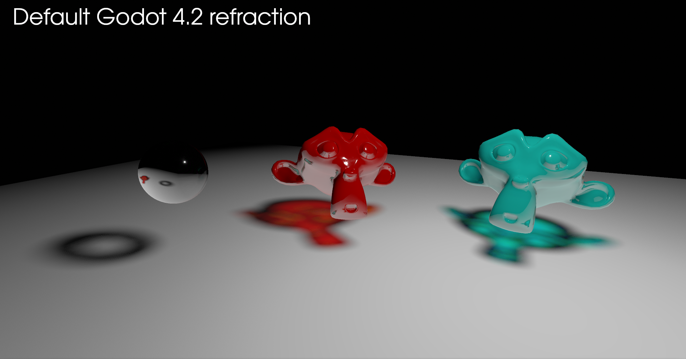
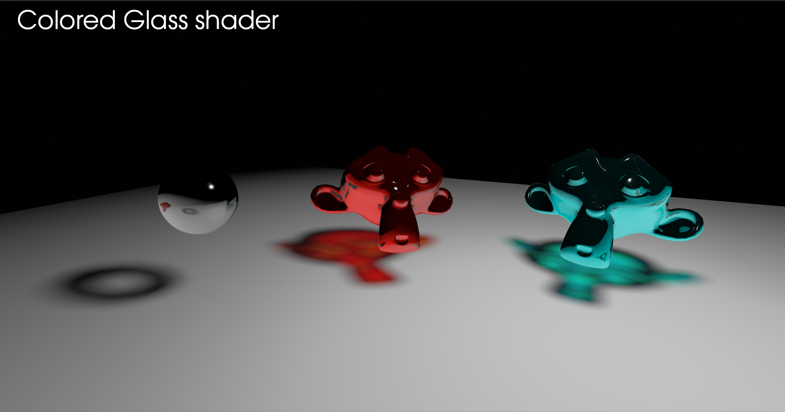

# **[Godot 4] Colored glass shader**

Standard godot material doesn't allow you to create colored glass, so this shader was created.

This shader is based on https://godotshaders.com/shader/pbr-glass/

This repository does not include colored caustics.

Default Godot Material

Colored Glass Shader

